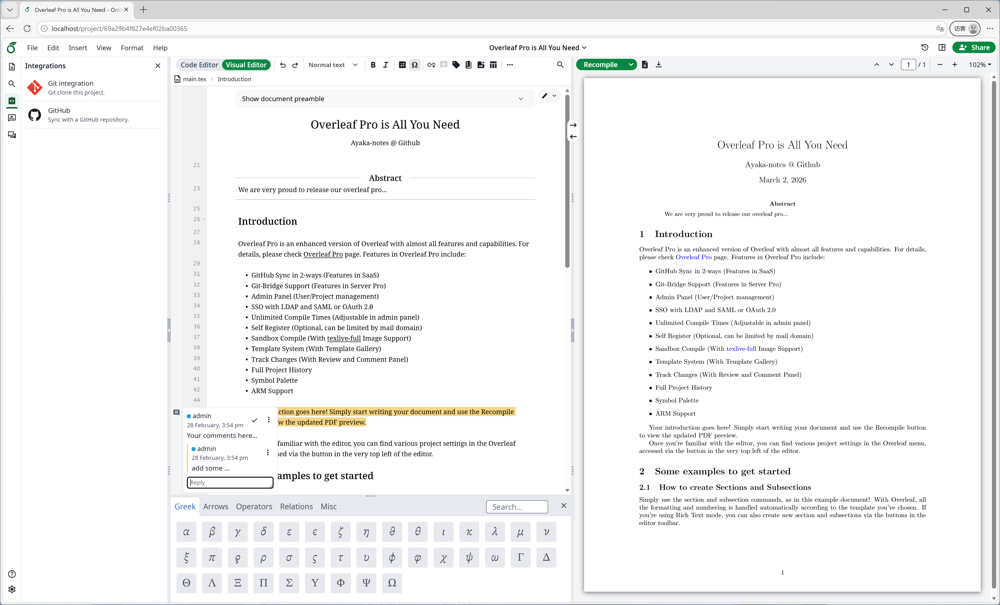

<h1 align="center">
   
  
</h1>

<h4 align="center">Overleaf Community Edition enhanced with all Pro features, plus in-progress Typst support  (open source, free to use, self-hostable).</h4>

  <a href="https://overleaf-pro.ayaka.space">Documents</a> •
  <a href="https://github.com/orgs/ayaka-notes/packages/container/package/overleaf-pro">Docker Image</a> •
  <a href="https://github.com/ayaka-notes/texlive-full">TeXLive</a> •
  <a href="https://overleaf-pro.ayaka.space/dev">Developer</a> •
  <a href="#authors">Authors</a> •
  <a href="#license">License</a>

  Figure 1: A screenshot of a project being edited in Overleaf Pro Edition.

## Overleaf Pro Edition
Overleaf Pro is an enhanced version of Overleaf with almost all features and capabilities. For details, please check [Overleaf Pro](https://overleaf-pro.ayaka.space) page. Features in Overleaf Pro include: 

- Pandoc Import/Export (Features in SaaS Platform)
- Python Script Runner (Features in SaaS Platform)
- 2-way GitHub Sync (Features in SaaS Platform)
- Zotero Integration(With Zotero OAuth Support)
- Advanced Reference Search (Features in SaaS Platform)
- Git-Bridge Support (Features in Server Pro)
- Admin Panel (Global Users/Projects management)
- SSO with LDAP and SAML or OAuth 2.0
- Unlimited Compile Times (Adjustable in admin panel)
- Self Register (Optional, can be limited by mail domain)
- Sandbox Compile (With [texlive-full](https://github.com/ayaka-notes/texlive-full) image support)
- Template System (With Template Gallery)
- Track Changes (With Review and Comment Panel)
- Full Project History(With Restore and Download)
- Symbol Palette (From [Overleaf SaaS](https://docs.overleaf.com/writing-and-editing/inserting-symbols) feature)
- ARM Support(x86_64/arm64 on Docker)

This fork additionally carries active **Typst** integration work (see [Typst Support in This Fork](#typst-support-in-this-fork) below).

Last but not least, Overleaf Pro is open-source, free to use and modify. You can self-host it and contribute to the development of Overleaf Pro. For more details, please check [Developer Documentation](https://overleaf-pro.ayaka.space/dev) page.

> [!NOTE]
> Note: Overleaf Pro is not affiliated with Overleaf, Inc. or its parent company, Digital Science. It is also *not Server Pro* Edition, which is a commercial product offered by Overleaf, Inc.
>
> Overleaf Pro is an independent project developed and maintained by the [ayaka-notes](https://github.com/ayaka-notes).

## Typst Support in This Fork

This repository contains fork-specific Typst work that is separate from upstream Overleaf Community Edition.

### Implemented

- Typst projects can compile in the development stack without pulling in TeX Live for the Typst image path.
- Typst compile output URLs work in local development.
- The file outline works for Typst headings in the code editor.
- PDF sync navigation is implemented for Typst at the block level:
  - headings
  - text paragraphs
  - `#figure(...)` blocks, including tables wrapped in figures
- The `Visual Editor` toggle is hidden for `.typ` files for now, so Typst stays in code-editor mode.

### Planned / Not Yet Implemented

- A real Typst visual editor.
- Finer-grained Typst sync inside a paragraph or inline span (for example, word-level or character-level sync).
- Standalone table anchors outside `#figure(...)`.
- More precise table and figure targeting, such as caption-only or cell-level sync.
- Broader Typst UX polish and parity work across the editor.

### Known Limitations / Current Bugs

- PDF-to-code inverse sync for Typst is currently disabled in the PDF preview UI.
- The disablement is intentional for now because double-clicking PDF text could resolve to the wrong source location in some documents.
- Code-to-PDF sync remains available, but Typst sync behavior should still be treated as work in progress.
- If you are testing Typst in this fork, expect rough edges around sync precision, anchor selection, and editor/PDF parity.

## Keeping up to date

Sign up to the [mailing list](https://mailchi.mp/overleaf.com/community-edition-and-server-pro) to get updates on Overleaf releases and development.

## Installation

We have detailed installation instructions on the [Documents](https://overleaf-pro.ayaka.space/docs) page. We highly recommend installing Overleaf Pro using the [ayaka-notes/Toolkit](https://github.com/ayaka-notes/toolkit/).

## Upgrading

If you are upgrading from a previous version of Overleaf Pro, please see the [Releases page](https://github.com/ayaka-notes/overleaf-pro/releases) for the changes in each version between your current version and the one you are upgrading to.

## Contributing

Please see the [CONTRIBUTING](CONTRIBUTING.md) file for information on contributing to the development of Overleaf.

## Authors

- [The Overleaf Team](https://www.overleaf.com/about)
- [Features and Copyright](https://overleaf-pro.ayaka.space/on-premises/readme/features-and-copyright)

## License

The code in this repository is released under the GNU AFFERO GENERAL PUBLIC LICENSE, version 3. A copy can be found in the [`LICENSE`](LICENSE) file.

- Copyright (c) Overleaf, 2014-2025.
- Copyright (c) [Pro Authors](https://overleaf-pro.ayaka.space/on-premises/readme/features-and-copyright), 2026-now.

## Star History

<a href="https://www.star-history.com/?repos=ayaka-notes%2Foverleaf-pro&type=date&legend=top-left">
 <picture>
   <source media="(prefers-color-scheme: dark)" srcset="https://api.star-history.com/chart?repos=ayaka-notes/overleaf-pro&type=date&theme=dark&legend=top-left&sealed_token=iMOB73kcExYo0bz6-pBM3lDoqj4ZzBFY9T8sqLHfpyyS-prxNb1332SQ2VhE6Jc8jE55Pu4yomIsHRPHNL8cwwck2w3LvbyoYxReMwSn_rutai8Hlk2oy_JluEe1Pumqboxg6rARw13GtG_KHr9Eq0rDb50lEAn3TE05eBpAwtTWnS-mkPXQshxJhpMe" />
   <source media="(prefers-color-scheme: light)" srcset="https://api.star-history.com/chart?repos=ayaka-notes/overleaf-pro&type=date&legend=top-left&sealed_token=iMOB73kcExYo0bz6-pBM3lDoqj4ZzBFY9T8sqLHfpyyS-prxNb1332SQ2VhE6Jc8jE55Pu4yomIsHRPHNL8cwwck2w3LvbyoYxReMwSn_rutai8Hlk2oy_JluEe1Pumqboxg6rARw13GtG_KHr9Eq0rDb50lEAn3TE05eBpAwtTWnS-mkPXQshxJhpMe" />
   
 </picture>
</a>